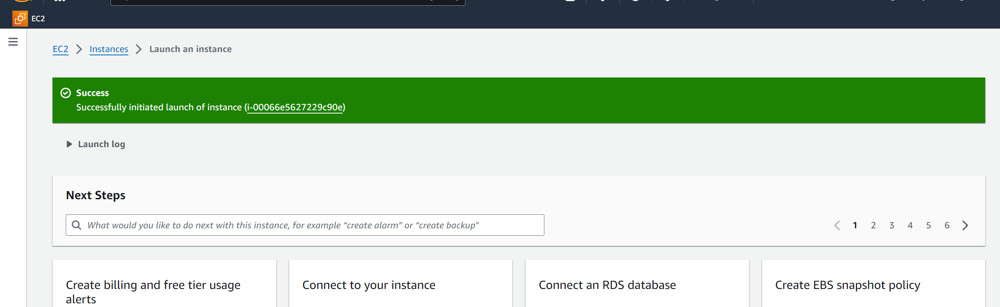
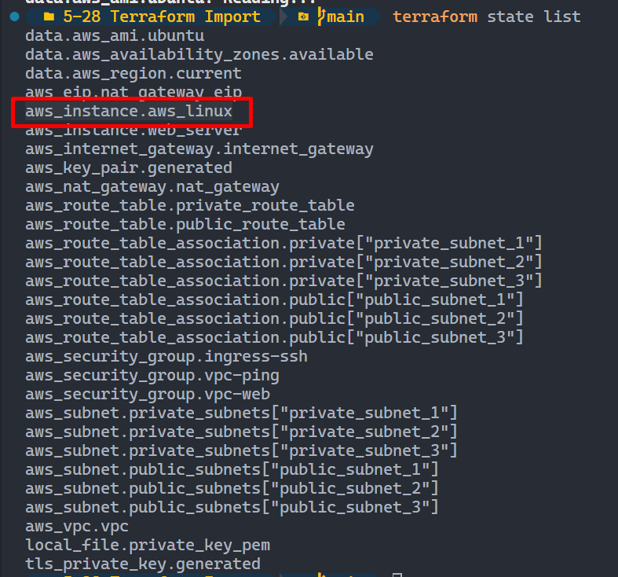

## Import

### 簡介

Terraform Import 是 Terraform 中的一個功能，允許你將現有的基礎設施資源導入到 Terraform 的狀態文件中。這樣，你可以將已有的基礎設施與 Terraform 的配置文件同步，並開始使用 Terraform 來管理這些資源

### 什麼時候需要用到 `terraform import`？

> [!NOTE]
> terraform import 並不是一個自動偵測 AWS 資源上的東西，然後自動幫忙寫程式碼的工具
如果你以前沒有使用任何 IaC 的工具，都是直接在 AWS Console 上管理和創建資源，但現在想要導入 IaC，然後把那些「現有資源」導入到 Terraform 來管理，那你就會需要用到 `terraform import`

`terraform import` 的主要目的是將已經存在的基礎設施資源導入到 Terraform 的狀態文件中，這樣你就可以用 Terraform 來管理這些資源。例如，如果你有一個已經存在的 AWS EC2 實例，而你現在想開始用 Terraform 來管理它，你需要導入這個實例以便 Terraform 知道它的存在和當前狀態

### Synopsis

```bash
$ terraform import [options] ADDRESS ID
```

- `ADDRESS` 是 Terraform 配置中資源的地址。例如，`aws_instance.my_instance`
- `ID` 是資源的唯一標識符，這個值根據不同的資源類型會有所不同。例如，對於 AWS EC2 實例，這個 ID 是實例的 ID（例如 `i-1234567890abcdef0`）

### Example

```bash
$ terraform import aws_instance.my_instance i-1234567890abcdef0

data.aws_region.current: Reading...
data.aws_availability_zones.available: Reading...
data.aws_ami.ubuntu: Reading...
aws_instance.aws_linux: Import prepared!
  Prepared aws_instance for import
aws_instance.aws_linux: Refreshing state... [id=i-00066e5627229c90e]
data.aws_region.current: Read complete after 0s [id=us-east-1]
data.aws_availability_zones.available: Read complete after 1s [id=us-east-1]
data.aws_ami.ubuntu: Read complete after 1s [id=ami-0f81732f07ce19b1c]

Import successful!

The resources that were imported are shown above. These resources are now in
your Terraform state and will henceforth be managed by Terraform.
```

### Hands-on

到 AWS Console 創建資源

我這邊創建了一台 EC2 Instance



接著在 [main.tf](http://main.tf) 加入以下程式碼:

```bash
resource "aws_instance" "aws_linux" {

}
```

打開 Terminal 使用 `terraform import` 來 import 現有的資源

```bash
$ terraform import aws_instance.aws_linux i-00066e5627229c90e

data.aws_region.current: Reading...
data.aws_availability_zones.available: Reading...
data.aws_ami.ubuntu: Reading...
aws_instance.aws_linux: Import prepared!
  Prepared aws_instance for import
aws_instance.aws_linux: Refreshing state... [id=i-00066e5627229c90e]
data.aws_region.current: Read complete after 0s [id=us-east-1]
data.aws_availability_zones.available: Read complete after 1s [id=us-east-1]
data.aws_ami.ubuntu: Read complete after 1s [id=ami-0f81732f07ce19b1c]

Import successful!

The resources that were imported are shown above. These resources are now in
your Terraform state and will henceforth be managed by Terraform.
```

用 `terraform state list` 查看一下現在的 state，會看到我們的 `aws_instance.aws_linux`



輸入看看 `terraform plan` :

```bash
$ terrafomr plan

╷
│ Error: Missing required argument
│
│   with aws_instance.aws_linux,
│   on main.tf line 263, in resource "aws_instance" "aws_linux":
│  263: resource "aws_instance" "aws_linux" {
│
│ "launch_template": one of `ami,instance_type,launch_template` must be specified
╵
╷
│ Error: Missing required argument
│
│   with aws_instance.aws_linux,
│   on main.tf line 263, in resource "aws_instance" "aws_linux":
│  263: resource "aws_instance" "aws_linux" {
│
│ "ami": one of `ami,launch_template` must be specified
╵
╷
│ Error: Missing required argument
│
│   with aws_instance.aws_linux,
│   on main.tf line 263, in resource "aws_instance" "aws_linux":
│  263: resource "aws_instance" "aws_linux" {
│
│ "instance_type": one of `instance_type,launch_template` must be specified
```

出現 ERROR 很正常，畢竟就是看著我們的程式碼去執行該指令，而我們的 `resource "aws_instance" "aws_linux" {}` 裡面都沒配置任何參數當然會出錯，要解決可以用 `terraform state show` 來處理，把這個資源的詳細資訊配置到我們程式碼，因為我們已經知道他被寫入 state

使用 `terraform state show` 來查看資源的詳細資訊:

```bash
$ terraform state show aws_instance.aws_linux

# aws_instance.aws_linux:
resource "aws_instance" "aws_linux" {
    ami                                  = "ami-00beae93a2d981137"
    arn                                  = "arn:aws:ec2:us-east-1:058264428816:instance/i-00066e5627229c90e"
    associate_public_ip_address          = true
    availability_zone                    = "us-east-1b"
    cpu_core_count                       = 1
    cpu_threads_per_core                 = 1
    disable_api_stop                     = false
    disable_api_termination              = false
    ebs_optimized                        = false
    get_password_data                    = false
    hibernation                          = false
    host_id                              = null
# 略...
```

然後根據上面面 `terraform state show` 輸出的結果把程式碼改成如下:

```bash
# main.tf

resource "aws_instance" "aws_linux" {

  instance_type = "t2.micro"
  ami           = "ami-00beae93a2d981137"

}

```

接著再輸入 `terraform plan` 就不會報錯了，此時我們原先在 AWS Console 上手動建立了資源就被 Terraform 所管

如果我們要刪掉那個資源也可以透過 terraform 來刪除，我們把原先那行註解掉:

```bash
# main.tf

# resource "aws_instance" "aws_linux" {

#   instance_type = "t2.micro"
#   ami           = "ami-00beae93a2d981137"

# }
```

接著我們再來執行 `terraform plan` :

```bash
$ terraform plan

# 略...
# aws_instance.aws_linux will be destroyed
  # (because aws_instance.aws_linux is not in configuration)
  - resource "aws_instance" "aws_linux" {
      - ami                                  = "ami-00beae93a2d981137" -> null
      - arn                                  = "arn:aws:ec2:us-east-1:058264428816:instance/i-00066e5627229c90e" -> null
      - associate_public_ip_address          = true -> null
      - availability_zone                    = "us-east-1b" -> null
      - cpu_core_count                       = 1 -> null

```

### 補充 - 直接寫在程式碼內，import block

在 Terraform v1.5.0 之後，引入了新的 [`import` block](https://developer.hashicorp.com/terraform/language/import)，`import` block 可以直接在 Terraform 配置文件中指定哪些資源需要被導入，而不需要單獨執行 `terraform import` 命令

這個新功能的好處在於，當你和你的團隊需要多次或系統地導入資源時，可以將這些導入操作版本化並包含在基礎設施即代碼（IaC）配置中

一個 `import` block 的基本語法如下:

```bash
import {
  to = aws_instance.example
  id = "i-12345678"
}
```

- `to` 指定了要導入到的 Terraform 資源塊
- `id` 是現有資源的 ID

所以剛才我們用 CLI 所示範的內容，你可以改成用以下方式來撰寫

```bash
resource "aws_instance" "aws_linux" {
  # 你的資源配置
}

import {
  to = aws_instance.example
  id = "i-00066e5627229c90e"
}

```

### Resources

- [Import | Terraform | HashiCorp Developer](https://developer.hashicorp.com/terraform/cli/import)
- [Shiun's Learning Journal - 20240605](https://www.notion.so/20240605-a29a522dba9d4e8eb7a60fe899595908?pvs=21)
